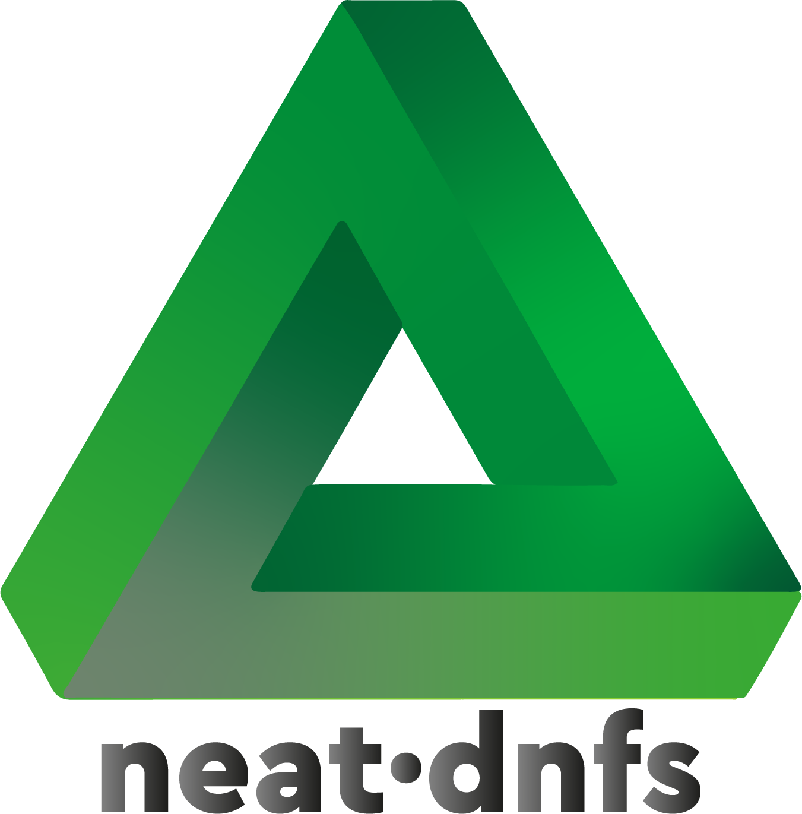
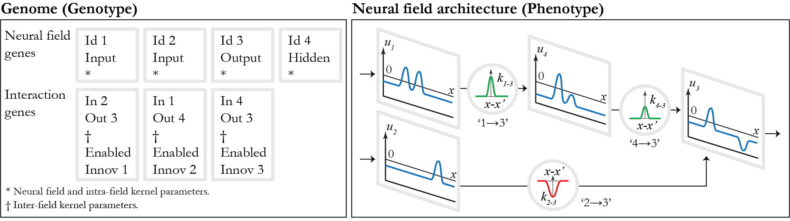

# neat-dnfs

## A NeuroEvolutionary Framework for Evolving Dynamic Neural Field Architectures



**neat-dnfs** is a C++ framework that extends **NeuroEvolution of Augmenting Topologies (NEAT)** to the automated synthesis of **Dynamic Neural Field (DNF)** architectures.
It enables the joint evolution of **continuous-time neural dynamics**, **kernel-based interactions**, and **architectural topology**, supporting the discovery of compact and interpretable Dynamic Field Theory (DFT) models without manual tuning.

---

## Overview

Dynamic Neural Fields (DNFs) provide a biologically grounded and mathematically principled framework for modelling neural population dynamics underlying perception, working memory, selection, and decision-making. Despite their expressive power, DNF architectures are traditionally **hand-designed and manually parameterised**, a process that is time-consuming, difficult to generalise, and highly dependent on expert knowledge.

**neat-dnfs** addresses this limitation by integrating DNFs with **neuroevolution**.
By extending NEAT to operate directly on neural fields and spatial interaction kernels—rather than discrete neurons and scalar weights—the framework enables the **autonomous discovery of DNF architectures** that exhibit desired dynamical behaviours.

The system evolves both:

* **Intrinsic field dynamics** (e.g., time constants, resting levels, kernel profiles)
* **Inter-field structure** (number of fields and their spatial couplings)

Evolution proceeds from minimal architectures and introduces complexity **only when required by task constraints**, in line with the minimal cognitive construction principle.

---

## Key Features

* **Evolution of Dynamic Neural Field Architectures**
  Simultaneous evolution of neural field parameters and architectural topology.

* **Continuous-Time, Kernel-Based Neuroevolution**
  Genomes encode spatial interaction kernels and field dynamics instead of discrete synaptic weights.

* **Incremental Structural Complexification**
  New fields and interactions emerge gradually through NEAT-style structural mutations.

* **Interpretability by Design**
  Evolved solutions consist of explicit neural fields with identifiable functional roles.

* **Task-General Framework**
  Applicable to a hierarchy of DFT-inspired tasks, from basic instabilities to compositional cognitive paradigms.

* **Comprehensive Evolutionary Analysis**
  Built-in logging, statistics, and visualisation of species, genomes, and architectural growth.

---

## Architecture

### Core Components

| Component             | Description                                                                              |
| --------------------- | ---------------------------------------------------------------------------------------- |
| **Genome**            | Encodes a DNF-based architecture as field genes and interaction genes.                   |
| **Population**        | Manages evolution, evaluation, selection, and reproduction.                              |
| **Species**           | Groups similar architectures to protect structural innovation.                           |
| **Solution**          | Defines task-specific fitness evaluation based on field dynamics.                        |
| **Field Genes**       | Represent individual neural fields (input, hidden, output) and their intrinsic dynamics. |
| **Interaction Genes** | Represent spatially structured kernel-based couplings between fields.                    |



**Genotype-to-phenotype mapping in neat-dnfs.**
*Field genes encode intrinsic neural field dynamics, while interaction genes specify kernel-defined couplings. Together, they map directly to a continuous-time DNF architecture.*

---

## Evolutionary Process

1. **Initialization** – Start from ultra-minimal architectures (input and output fields only).
2. **Simulation** – Evaluate continuous-time DNF dynamics under task-specific stimuli.
3. **Fitness Evaluation** – Assess qualitative dynamical properties (e.g., peak formation, stability, selection).
4. **Speciation** – Protect novel architectural innovations using compatibility distance.
5. **Selection & Reproduction** – Apply NEAT-style crossover and fitness sharing.
6. **Mutation** – Refine parameters or introduce new fields and interactions.

---

## Implemented Tasks

The framework includes a hierarchy of benchmark tasks designed to probe increasingly complex DFT mechanisms:

### Core Dynamic Mechanisms

* **Detection Instability** – Transient input-driven activation and decay
* **Memory Instability** – Self-sustained activation without input
* **Selection Instability** – Winner-take-all competition

### Compositional Tasks Requiring Structural Innovation

* **Delayed Match-to-Sample (DMTS)** – Internal memory biasing later selection
* **Inhibition of Return (IOR)** – Delayed inhibitory bias against previously selected locations

Additional simple logical tasks (e.g., AND, XOR) are included for validation and demonstration.

---

## Building

### Prerequisites

* **CMake 3.31.6+**
* **C++20** compiler
* **VCPKG** package manager

**Dependencies (via VCPKG):**

* `imgui`, `implot`, `imgui-node-editor`, `nlohmann-json`

**Additional dependencies:**

* [`imgui-platform-kit`](https://github.com/Jgocunha/imgui-platform-kit)
* [`dynamic-neural-field-composer`](https://github.com/Jgocunha/dynamic-neural-field-composer)

### Build Instructions

```bash
export VCPKG_ROOT=/path/to/vcpkg
mkdir build && cd build
cmake ..
cmake --build . --config Release
```

---

## Usage

### Basic Example

```cpp
#include "neat/population.h"
#include "solutions/xor.h"

XOR solution{ SolutionTopology{{ 
    { {FieldGeneType::INPUT, {50, 1.0}}, 
      {FieldGeneType::INPUT, {50, 1.0}}, 
      {FieldGeneType::OUTPUT, {50, 1.0}} } 
}}};

PopulationParameters parameters{100, 150, 0.95};
Population population{parameters, std::make_unique<XOR>(solution)};
population.initialize();
population.evolve();
```

### Custom Tasks

To define a new task:

1. Inherit from the `Solution` base class
2. Specify the initial minimal topology
3. Implement `evaluate()` using field-dynamics-based fitness criteria

```cpp
void evaluate() override 
{
    // Define fitness in terms of DNF dynamics:
    // peak existence, position, amplitude, width, or decay to baseline
    parameters.fitness = computedFitness;
}
```

---

## Statistics and Analysis

The framework automatically records:

* **Fitness evolution**
* **Species diversity and lineage**
* **Architectural complexity (fields and interactions)**
* **Mutation and structural growth statistics**

All data are stored in the `data/` directory.

### Analysis Tools (`analysis/`)

* **Per-generation fitness and diversity**
* **Genome and mutation statistics**
* **Architectural complexity tracking**

Run the `launch-visualizer.bat` to open a Streamlit app, and then select the experiment directory.

---

## Project Structure

```bash
neat-dnfs/
├── include/
│   ├── neat/          # Core NEAT-DNF implementation
│   ├── solutions/     # Task definitions
│   ├── tools/         # Logging and utilities
│   └── constants.h    # Hyperparameter definition
├── src/
├── examples/
├── tests/
├── data/              # Evolution outputs
├── analysis/          # Post-hoc analysis tools
└── CMakeLists.txt
```

---

## Video explanation

[](https://youtu.be/2QaL6OVnpkY)

---

## Documentation

For a full exploration of the repository, refer to the [Wiki.](https://github.com/anonymous-author-submissions/neat-dnfs/wiki)

---

## Main inspiration for this work

* Amari, Shun-ichi (1977) - "Dynamics of pattern formation in lateral-inhibition type neural fields"
* Schöner, Gregor and Spencer, John and Research Group, Dft (2015) - "Dynamic Thinking: A Primer on Dynamic Field Theory"
* Nolfi, Stefano and Floreano, Dario (2000) - "Evolutionary robotics: the biology, intelligence, and technology of self-organizing machines"
* Floreano, Dario (2023) - "Bio-Inspired Artificial Intelligence: Theories, Methods, and Technologies"
* Erlhagen, Wolfram and Bicho, Estela (2006) - "The dynamic neural field approach to cognitive robotics"
* Krichmar, Jeffrey L. (2018) - "Neurorobotics — A Thriving Community and a Promising Pathway Toward Intelligent Cognitive Robots"
* Stanley, Kenneth O. and Miikkulainen, Risto (2002) - "Evolving Neural Networks through Augmenting Topologies"
* Erlhagen, Wolfram and Bicho, Estela (2014) - "A Dynamic Neural Field Approach to Natural and Efficient Human-Robot Collaboration"
* Pfeifer, Rolf and Bongard, Josh (2006) - "How the Body Shapes the Way We Think: A New View of Intelligence"
* Coombes, Stephen and Beim Graben, Peter and Potthast, Roland and Wright, James (2014) - "Neural fields: theory and applications"


